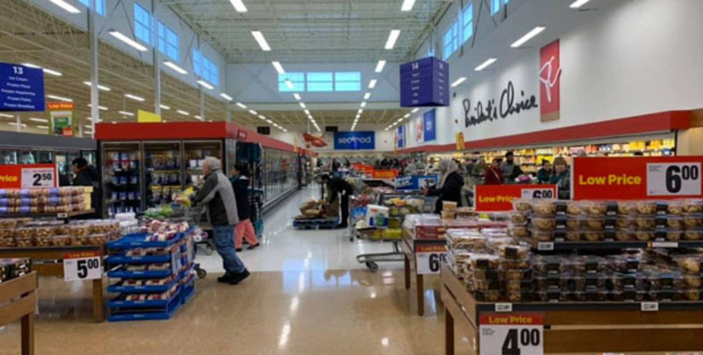
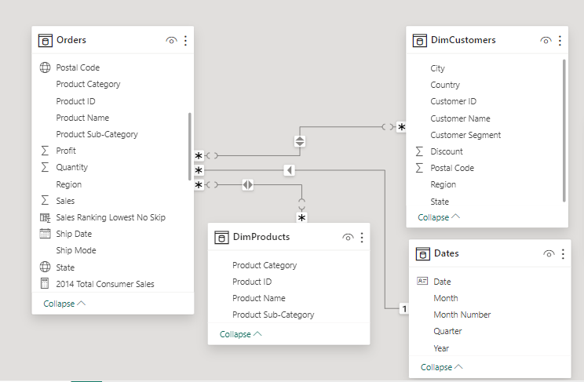
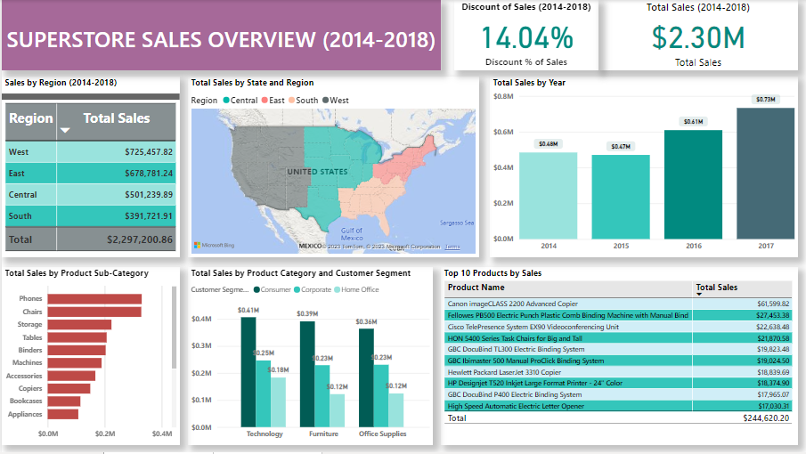
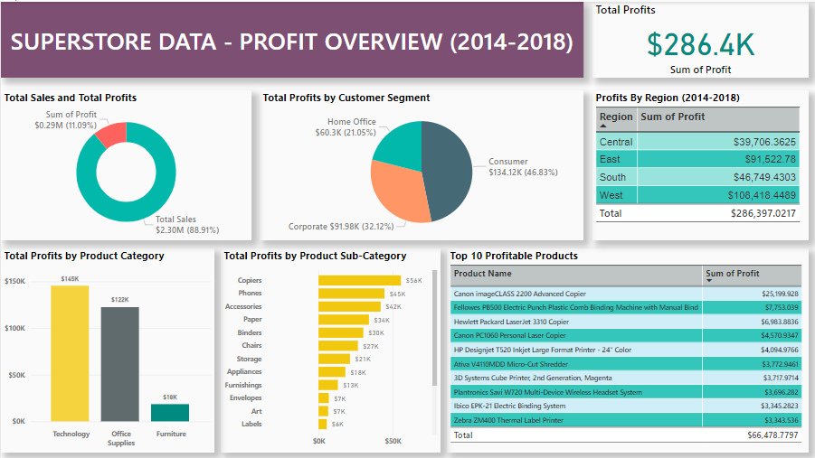

# Superstore Sales Analysis Using Power BI

## Introduction

This project is a deep dive into the sales and profit data of a Superstore, aimed at extracting actionable insights that could drive business decisions. With the retail landscape becoming increasingly competitive, Superstores need to understand what strategies work best for them. This project seeks to uncover which products, regions, categories, and customer segments are the most lucrative and which ones to approach with caution.

The main purpose of this project is to examine sales data to discover which products and regions maximize profit, which will enable the Superstore to refine its focus for increased efficiency, resulting in a strategic edge in a competitive retail market.

The analysis will leverage the capabilities of Power BI, a powerful business analytics tool, to interpret complex data and present it in an easily understandable format. Whether you're a business leader, a data analyst, or someone interested in the intersection of retail and data science, this project is designed to provide valuable insights. Using Power BI, I will transform complex data sets into actionable business intelligence, ultimately driving efficiency and competitive advantage in the market.

## Project Objective

The primary objectives of this project are:

- **Connect and Transform Raw Data:** Initially, I need to connect to the dataset and transform the raw data into a format suitable for analysis.

- **Build a Relational Data Model:** A well-structured relational data model will be the foundation of my analysis, enabling me to explore the relationships between different data elements.

- **Create Calculated Columns and DAX Measures:** By using DAX (Data Analysis Expressions), I'll create new columns and measures that help in unveiling deeper insights from the data.

- **Design Interactive Reports:** The final step involves creating interactive reports and dashboards in Power BI. These reports will not only visualize the data but will also allow users to interact with it to uncover specific insights.

## Steps of Data Analysis

**The following sales analysis will follow the 6 steps of Data Analysis which are: Ask, Prepare, Process, Analyze, Share and Act.**

### **Step 1. Ask: Defining the Problem and Objectives**

In this initial phase, I identify the core questions that the analysis seeks to answer. The objectives here are to understand which products, customer segments, regions, and categories yield the highest sales and profits. I aim to uncover patterns that can inform strategic business decisions.

#### **Business Objectives:**

- **Profit Optimization:** How can profit margins be enhanced across various product lines, customer segments, and regions?

- **Trend Analysis:** What are the prevailing sales and profit trends, and how do they vary by product, region, category, and customer segment?

- **Strategic Recommendations:** Based on identified trends and patterns, what strategic recommendations can be made to target optimal products, regions, categories, and customer segments?

#### **Deliverables:**

- **Business Objectives Summary:** A document detailing the business objectives derived from the core questions, providing a roadmap for the analysis.

- **Data Analysis Report:** A comprehensive report that includes all the steps taken during data cleaning, manipulation, and analysis, ensuring transparency and reproducibility of the findings.

- **Interactive Dashboards:** A Power BI dashboard that visually presents the data analysis, highlighting key trends, and patterns in sales and profits.

- **Strategic Insight Recommendations:** A strategic recommendations report that leverages insights from the data to suggest actionable steps for targeting or avoiding specific products, regions, categories, and customer segments to improve profitability.

### **Step 2. Prepare: Gathering and Preparing the Data**

During the preparation stage, I collect the necessary data that is publicly available in Kaggle. I ensure that the dataset includes all relevant information such as sales figures, profit margins, customer demographics, and product details. 

[Superstore Dataset](https://www.kaggle.com/datasets/vivek468/superstore-dataset-final)

The dataset for this project includes a variety of sales and profit data for a Superstore. Here's a quick overview of the metadata:

- Row ID: Unique ID for each row.
  
- Order ID: Unique Order ID for each Customer.
  
- Order Date: Date when the product was ordered.
  
- Ship Date: Date when the product was shipped.
  
- Ship Mode: Shipping Mode specified by the Customer.
  
- Customer ID: Unique ID for each Customer.
  
- Customer Name: Name of the Customer.
  
- Segment: Customer segment.
  
- Country, City, State, Postal Code: Location details of the Customer.
  
- Region: Region where the Customer is located.
  
- Product ID: Unique ID of the Product.
  
- Category & Sub-Category: Classification of the ordered product.
  
- Product Name: Name of the Product.
  
- Sales: Sales amount of the Product.
  
- Quantity: Quantity of the Product ordered.
  
- Discount: Discount provided on the Product.
  
- Profit: Profit or Loss incurred from the sale.
  
The data is then organized into a structured format suitable for analysis, making sure it's complete and ready for the next phase.

### **Step 3. Process: Cleaning and Structuring the Data**

I process the data by cleaning it using **Power BI**, which involves removing any inconsistencies, duplicates, or irrelevant information. I structure the dataset by sorting, filtering, DAX and segmenting the data to ensure accuracy and reliability. This step is crucial for maintaining data integrity and facilitates effective analysis.

### **Step 4. Analyze: Conducting the Analysis**

In the analysis phase, I apply statistical methods and data analysis techniques to extract insights from the processed data. I use Power BI to create visualizations that reveal trends, patterns, and anomalies. The analysis focuses on identifying the key drivers of sales and profitability across different dimensions of the data.

### **Step 5. Share: Sharing Findings through Reports and Dashboards**

Once the analysis is complete, I share the findings by creating comprehensive reports and interactive dashboards using Power BI. These visualizations allow stakeholders to grasp complex data insights intuitively. I ensure that the reports are clear, concise, and tailored to the audience's level of expertise.

### Table Relationships & Data Model View

### **Here are my findings:**

#### **Analysis:**

The dashboard presents a comprehensive view of sales performance across various dimensions, including region, product sub-category, customer segment, and year. It provides both granular and high-level insights into the sales trends and performances of the Superstore over five years (2014-2018).

**Key Insights**

**1: Regional Sales Distribution** 

- The 'West' region leads in total sales, indicating a strong customer base or successful marketing and sales strategies in that area.
  
- The 'South' region shows the least total sales, which could point to market penetration challenges or lesser demand in this region.

**2: Total Sales Trend** 

- There is a consistent increase in total sales year over year, suggesting growth and successful expansion of the business.
  
- The year 2017 shows a significant jump, indicating either a successful marketing campaign, introduction of new product lines, or market growth.
  
**3: Discount Impact**

- The discount percentage is significant, at 14.04% of total sales, which may be affecting profit margins.

- The effectiveness of the discounting strategy should be evaluated to ensure that it contributes positively to overall sales volume without compromising profit margins.
  
**4: Product Category Performance**

- Technology products are the highest-grossing category per customer segment, particularly among Corporate and Home Office segments. This suggests a strong market position in the technology sector.
  
- Furniture and Office Supplies have lower total sales by comparison, indicating potential areas for review and improvement.
  
**6: Top Products by Sales**

- The top products by sales include higher-value items such as technology and office machines, suggesting that high-ticket items are a significant sales driver.
  
- It may be beneficial to focus on strategies to boost the sales of higher-margin items within these top-performing categories.

In summary, the dashboard reveals a strong pattern of sales growth and highlights key areas where targeted actions could further strengthen market share and profitability.

The above dashboard provides a detailed visualization of profitability across various business dimensions:

- **Profitability Ratio:** The donut chart indicates a healthy profit ratio, with profits making up a significant portion of total sales. This suggests effective cost management and pricing strategies.

- **Customer Segment Profitability:** The majority of profits come from the Consumer segment, followed by Corporate and Home Office. This could reflect market size or purchasing power within these segments, with Consumer segment customers potentially yielding the highest return.

- **Regional Profit Distribution:** The West region stands out with the highest profits, while the Central region has the lowest. This disparity might be influenced by factors such as regional sales strategies, customer preferences, or competitive landscape.

- **Profit by Product Category:** Technology leads in profitability among product categories, which could indicate higher margins or sales volumes. Office Supplies and Furniture follow but with a significant gap, pointing to potential areas for margin improvement or cost reduction.

- **Sub-Category Performance:** Within sub-categories, items like Copiers and Phones contribute the highest profits, suggesting these are high-value areas with potentially better margins or sales effectiveness.

- **Top Products:** The list of top profitable products is dominated by high-ticket technology items, particularly copiers and printers. This aligns with the high profit seen in the Technology category and underscores the importance of these products to the overall profitability.

In essence, the dashboard underscores the significance of the Technology category and the Consumer segment to the store's profit generation. It also highlights the regional strengths and product-specific contributions to the bottom line, providing a clear indication of where the business might focus its sales and marketing efforts for continued growth. Strategic decisions might include investing more in successful regions and customer segments, as well as considering ways to bolster the profitability of lagging categories.

### **Step 6. Act: Making Informed Decisions Based on the Analysis**

The final step is to act on the insights gained from the analysis. I use the findings to make informed recommendations for business strategies. This may involve advising on which products to stock more, which regions to target or avoid, and how to optimize sales and marketing efforts. The goal is to enable the Superstore to act on data-driven insights for enhanced decision-making and strategic planning.

Each step in this process is methodically executed to ensure that the analysis is thorough and the insights generated are actionable. By following this structured approach, I aim to deliver an in-depth understanding of the Superstore's operational dynamics, contributing to its growth and success in a competitive market.

***Based on the analyses of the Sales and Profit Overview dashboards, here are my conclusions and future recommendations for the success of the Superstore:***

**1. Strengthen Performance in Key Regions**

- For regions with lower sales and profits (such as the South and Central), consider region-specific marketing campaigns, possibly tailored to local consumer behavior and preferences.
  
- Investigate the success factors in the West region, such as customer service strategies, product mix, or regional promotions, and attempt to replicate these in underperforming regions.
  
**2. Optimize Discount Strategies**

- Assess the impact of discounts on both sales volume and profit margins. If the high discount percentage is not yielding proportional increases in customer acquisition or retention, consider revising discount policies.
  
- Implement targeted discounts for higher-margin products or during strategic times to maximize revenue without significantly impacting profits.
  
**3. Enhance Product and Category Focus**

- Increase marketing support and inventory for high-profit technology products, which are major revenue drivers.
  
- Conduct a product mix analysis to identify and promote products with higher margins, especially within the Consumer segment.
  
**4. Leverage Customer Segmentation**

- Since the Consumer segment contributes significantly to profits, develop loyalty programs and personalized marketing to enhance customer retention and increase sales in this segment.
  
- Explore cross-selling and upselling opportunities within the Corporate and Home Office segments, where relationships and order sizes may be larger.
  
**5. Product Portfolio Management**

- For lagging product categories like Furniture and Office Supplies, analyze product pricing, cost structure, and supplier deals to improve margins.
  
- Consider expanding the range of high-demand, high-margin products within the Technology category.
  
**6. Review Inventory and Sales Strategy**

- Utilize inventory management strategies to ensure the availability of the top profitable products to meet demand and avoid stockouts.
  
- Analyze sales trends to forecast demand more accurately, helping to optimize stock levels and reduce holding costs.
  
**7. Data-Driven Decision Making**

- Invest in data analytics tools to gain deeper insights into customer purchasing patterns, seasonal trends, and product lifecycle management.
  
- Use predictive analytics to anticipate market changes and adapt strategies proactively.
  
By implementing these recommendations, the Superstore can aim to increase sales in lower-performing regions and segments, optimize discount strategies to maintain profitability, focus on high-margin products and categories, and utilize data analytics for informed decision-making.

